# BGP Setup with Route Filtering

[](https://opensource.org/licenses/MIT)
[]()
[]()
[]()

## 🌐 Overview

This repository contains a comprehensive BGP (Border Gateway Protocol) setup demonstrating advanced route filtering mechanisms between autonomous systems. The project includes PlantUML network diagrams, complete router configurations, and interactive visualization components to illustrate BGP route filtering concepts for educational and professional networking scenarios.

The implementation showcases a three-router BGP topology where **RouterA (AS 65001)** acts as a central hub connecting to **RouterB (AS 65002)** and **RouterC (AS 65003)**, with sophisticated route filtering policies controlling advertisement and acceptance of network prefixes.

## 📋 Table of Contents

- [Network Architecture](#-network-architecture)
- [Route Filtering Implementation](#️-route-filtering-implementation)
- [Repository Structure](#-repository-structure)
- [Configuration Files](#-configuration-files)
- [PlantUML Diagrams](#-plantuml-diagrams)
- [Installation & Setup](#-installation--setup)
- [Usage Instructions](#-usage-instructions)
- [Interactive Visualization](#-interactive-visualization)
- [Verification Commands](#-verification-commands)
- [Educational Resources](#-educational-resources)
- [Contributing](#-contributing)
- [License](#-license)

## 🏗️ Network Architecture

### Autonomous Systems Layout
```
    AS 65002 (RouterB)
           |
           | eBGP
           |
    AS 65001 (RouterA) ←--eBGP--→ AS 65003 (RouterC)
      Central Hub
```

### BGP Peering Relationships
- **RouterA (AS 65001)** ←→ **RouterB (AS 65002)** - Primary eBGP session
- **RouterA (AS 65001)** ←→ **RouterC (AS 65003)** - Secondary eBGP session
- **Connection Type**: External BGP (eBGP) between different autonomous systems
- **Filtering Applied**: Bidirectional route filtering using prefix lists and route maps

### Network Segments

| Router | AS Number | Advertised Networks | Interface IPs |
|--------|-----------|-------------------|---------------|
| RouterA | 65001 | 172.16.0.0/16 (filtered outbound) | 192.0.2.1/30 |
| RouterB | 65002 | 10.0.0.0/24, 172.16.0.0/16 | 192.0.2.2/30 |
| RouterC | 65003 | 192.168.1.0/24, 10.10.10.0/24 | 192.0.2.3/30 |

## 🛡️ Route Filtering Implementation

### RouterA Inbound Filtering Policy
**Objective**: Accept only specific prefixes from BGP neighbors

```cisco
! Prefix List Definition
ip prefix-list PrefixList_In seq 5 permit 10.0.0.0/24
ip prefix-list PrefixList_In seq 10 permit 192.168.1.0/24
ip prefix-list PrefixList_In seq 15 deny 0.0.0.0/0 le 32

! Route Map Application
route-map INBOUND permit 10
 match ip address prefix-list PrefixList_In
```

**Filtering Results**:
- ✅ **10.0.0.0/24** from RouterB - **ACCEPTED**
- ❌ **172.16.0.0/16** from RouterB - **DENIED**
- ✅ **192.168.1.0/24** from RouterC - **ACCEPTED**
- ❌ **10.10.10.0/24** from RouterC - **DENIED**

### RouterA Outbound Filtering Policy
**Objective**: Advertise only enterprise networks to specific neighbors

```cisco
! Prefix List Definition
ip prefix-list PrefixList_Out seq 5 permit 172.16.0.0/16
ip prefix-list PrefixList_Out seq 10 deny 0.0.0.0/0 le 32

! Route Map Application
route-map OUTBOUND permit 10
 match ip address prefix-list PrefixList_Out
```

**Advertisement Policy**:
- ✅ **172.16.0.0/16** - **ADVERTISED** to RouterB only
- ❌ All other prefixes - **BLOCKED**

## 📁 Repository Structure

```
BGP-setup-with-route-filtering/
├── README.md                           # This comprehensive guide
├── diagrams/
│   ├── bgp-topology.puml              # PlantUML network diagram
│   ├── bgp-topology.png               # Rendered topology image
│   ├── route-flow.puml                # Route advertisement flow
│   └── filtering-process.puml         # Route filtering visualization
├── configs/
│   ├── RouterA-config.txt             # Complete RouterA configuration
│   ├── RouterB-config.txt             # Complete RouterB configuration
│   ├── RouterC-config.txt             # Complete RouterC configuration
│   ├── prefix-lists/
│   │   ├── inbound-filters.txt        # Inbound prefix list definitions
│   │   └── outbound-filters.txt       # Outbound prefix list definitions
│   └── route-maps/
│       ├── inbound-policies.txt       # Inbound route map configurations
│       └── outbound-policies.txt      # Outbound route map configurations
├── verification/
│   ├── show-commands.txt              # BGP verification commands
│   ├── expected-outputs.txt           # Expected command outputs
│   └── troubleshooting-guide.md       # Common issues and solutions
├── docs/
│   ├── bgp-fundamentals.md            # BGP protocol overview
│   ├── route-filtering-guide.md       # Detailed filtering explanation
│   ├── lab-setup-instructions.md     # Physical/virtual lab setup
│   └── certification-notes.md        # CCNA/CCNP relevant information
└── html-mockup/
    ├── index.html                     # Interactive visualization
    ├── styles.css                     # Visualization styling
    ├── script.js                      # Interactive functionality
    └── README.md                      # HTML mockup documentation
```

## 🔧 Configuration Files

### RouterA Complete Configuration
```cisco
hostname RouterA
!
router bgp 65001
 bgp router-id 1.1.1.1
 bgp log-neighbor-changes
 !
 ! BGP Neighbor Configurations
 neighbor 192.0.2.2 remote-as 65002
 neighbor 192.0.2.2 description "RouterB eBGP Peer"
 neighbor 192.0.2.2 route-map INBOUND in
 neighbor 192.0.2.2 route-map OUTBOUND out
 !
 neighbor 192.0.2.3 remote-as 65003
 neighbor 192.0.2.3 description "RouterC eBGP Peer"
 neighbor 192.0.2.3 route-map INBOUND in
 !
 ! Network Advertisements
 network 172.16.0.0 mask 255.255.0.0
!
! Inbound Prefix List
ip prefix-list PrefixList_In seq 5 permit 10.0.0.0/24
ip prefix-list PrefixList_In seq 10 permit 192.168.1.0/24
ip prefix-list PrefixList_In seq 15 deny 0.0.0.0/0 le 32
!
! Outbound Prefix List
ip prefix-list PrefixList_Out seq 5 permit 172.16.0.0/16
ip prefix-list PrefixList_Out seq 10 deny 0.0.0.0/0 le 32
!
! Route Maps
route-map INBOUND permit 10
 match ip address prefix-list PrefixList_In
 set local-preference 150
!
route-map OUTBOUND permit 10
 match ip address prefix-list PrefixList_Out
 set as-path prepend 65001
!
! Interface Configuration
interface GigabitEthernet0/0
 ip address 192.0.2.1 255.255.255.252
 no shutdown
!
interface Loopback0
 ip address 1.1.1.1 255.255.255.255
```

## 🎨 PlantUML Diagrams

### Network Topology Diagram
The repository includes comprehensive PlantUML diagrams:

**bgp-topology.puml** - Main network architecture:
```plantuml
@startuml BGP Network Topology
!define ROUTER_COLOR #87CEEB
!define FILTER_COLOR #90EE90
!define CONNECTION_COLOR #2563EB

package "AS 65001" {
  node RouterA [
    RouterA
    192.0.2.1
    Loopback: 1.1.1.1
  ] ROUTER_COLOR
}

package "AS 65002" {
  node RouterB [
    RouterB
    192.0.2.2
    Networks: 10.0.0.0/24, 172.16.0.0/16
  ] ROUTER_COLOR
}

package "AS 65003" {
  node RouterC [
    RouterC
    192.0.2.3
    Networks: 192.168.1.0/24, 10.10.10.0/24
  ] ROUTER_COLOR
}

RouterA <--> RouterB : eBGP\nFiltered
RouterA <--> RouterC : eBGP\nFiltered

note right of RouterA
  Inbound Filter:
  - Accept: 10.0.0.0/24, 192.168.1.0/24
  - Deny: All others
  
  Outbound Filter:
  - Advertise: 172.16.0.0/16
  - Deny: All others
end note

@enduml
```

### Route Flow Visualization
**route-flow.puml** - Advertisement and filtering process:

```plantuml
@startuml BGP Route Flow
RouterB -> RouterA: Advertise 10.0.0.0/24 ✓
RouterB -> RouterA: Advertise 172.16.0.0/16 ✗
RouterC -> RouterA: Advertise 192.168.1.0/24 ✓
RouterC -> RouterA: Advertise 10.10.10.0/24 ✗
RouterA -> RouterB: Advertise 172.16.0.0/16 ✓
@enduml
```


## 🚀 Installation & Setup

### Prerequisites
- **Network Simulator**: GNS3, EVE-NG, or Cisco Packet Tracer
- **Router Images**: Cisco IOS 15.x+ or equivalent
- **PlantUML**: For diagram generation and modification
- **Text Editor**: VS Code, Notepad++, or similar

### Quick Start Guide

1. **Clone the Repository**:
```bash
git clone https://github.com/yourusername/BGP-setup-with-route-filtering.git
cd BGP-setup-with-route-filtering
```

2. **Set Up Network Topology**:
   - Import the network topology into your simulator
   - Use the provided IP addressing scheme
   - Configure basic interface settings

3. **Apply BGP Configurations**:
```bash
# Copy configurations to routers
# For RouterA:
Router(config)# copy running-config startup-config
```

4. **Verify PlantUML Diagrams**:
```bash
# Generate PNG from PlantUML
plantuml diagrams/bgp-topology.puml
```

## 🎯 Usage Instructions

### Step-by-Step Implementation

1. **Physical/Virtual Lab Setup**:
   - Configure three routers with the specified IP addresses
   - Ensure connectivity between RouterA-RouterB and RouterA-RouterC
   - Verify interface status and reachability

2. **BGP Basic Configuration**:
```cisco
! On each router, configure BGP with appropriate AS numbers
router bgp [AS-NUMBER]
bgp router-id [ROUTER-ID]
```

3. **Apply Route Filtering**:
   - Configure prefix lists on RouterA
   - Create route maps linking to prefix lists
   - Apply route maps to BGP neighbors

4. **Verification Process**:
```cisco
show ip bgp summary
show ip bgp neighbors
show ip bgp
show ip route bgp
```

### Configuration Validation Checklist
- [ ] BGP sessions established with all neighbors
- [ ] Route advertisements matching expected behavior
- [ ] Inbound filtering blocking unwanted prefixes
- [ ] Outbound filtering controlling advertisements
- [ ] BGP table showing only accepted routes

## 🖥️ Interactive Visualization

The repository includes an interactive HTML mockup in the `html-mockup/` directory:

### Features
- **Clickable Network Elements**: Interactive routers, filters, and connections
- **Configuration Viewer**: Modal displays showing complete router configs
- **Route Flow Animation**: Visual representation of route advertisements
- **Educational Tooltips**: Contextual information for learning

### Accessing the Visualization
```bash
cd html-mockup/
# Open index.html in a modern web browser
# Or serve locally:
python -m http.server 8000
# Navigate to http://localhost:8000
```

## 🔍 Verification Commands

### Essential BGP Show Commands
```cisco
! Check BGP session status
show ip bgp summary

! Verify received routes
show ip bgp neighbors 192.0.2.2 received-routes

! Check advertised routes
show ip bgp neighbors 192.0.2.2 advertised-routes

! Validate route filtering
show ip bgp | include 10.0.0.0
show ip bgp | include 192.168.1.0

! Examine prefix lists
show ip prefix-list PrefixList_In
show ip prefix-list PrefixList_Out

! Review route maps
show route-map INBOUND
show route-map OUTBOUND
```

### Expected Outputs
The `verification/expected-outputs.txt` file contains sample outputs for comparison during lab validation.

### Troubleshooting Common Issues
- **BGP Session Not Established**: Check interface connectivity and AS number configuration
- **Routes Not Filtered**: Verify prefix list syntax and route map application
- **Incorrect Route Selection**: Examine BGP attributes and filtering policies

## 📚 Educational Resources

### Learning Objectives
After completing this lab, you will understand:
- BGP autonomous system concepts
- eBGP vs iBGP peering relationships
- Route filtering using prefix lists
- Route map implementation and application
- BGP path selection process
- Network security through route filtering

### Certification Relevance
This project aligns with:
- **CCNA**: BGP fundamentals and basic filtering
- **CCNP Enterprise**: Advanced BGP configuration and route manipulation
- **CCIE**: Complex BGP policies and troubleshooting

### Additional Study Materials
- `/docs/bgp-fundamentals.md` - Protocol overview and concepts
- `/docs/route-filtering-guide.md` - Detailed filtering mechanisms
- `/docs/lab-setup-instructions.md` - Physical lab deployment
- `/docs/certification-notes.md` - Exam-specific information

## 🤝 Contributing

We welcome contributions to improve this BGP educational project!

### How to Contribute
1. **Fork the repository**
2. **Create a feature branch** (`git checkout -b feature/improvement`)
3. **Make your changes**:
   - Update configurations
   - Enhance documentation
   - Add new diagrams
   - Improve verification scripts
4. **Commit changes** (`git commit -am 'Add new feature'`)
5. **Push to branch** (`git push origin feature/improvement`)
6. **Create Pull Request**

### Contribution Areas
- Additional vendor configurations (Juniper, Arista, etc.)
- Enhanced PlantUML diagrams
- Interactive visualization improvements
- Troubleshooting scenarios
- Performance optimization examples
- Security best practices

### Code Standards
- Follow Cisco IOS configuration syntax
- Use consistent commenting in config files
- Maintain PlantUML diagram formatting
- Update documentation for any changes

## 📄 License

This project is licensed under the MIT License - see the [LICENSE](LICENSE) file for details.

### Permissions
- ✅ Commercial use
- ✅ Modification
- ✅ Distribution
- ✅ Private use

### Limitations
- ❌ Liability
- ❌ Warranty

## 🙏 Acknowledgments

Special thanks to:
- **Cisco Systems** for BGP configuration syntax and best practices
- **PlantUML Community** for diagram specification standards
- **Network Engineering Community** for shared knowledge and feedback
- **Educational Institutions** using this material for network training
- **Open Source Contributors** who have enhanced this project

## 📞 Support & Contact

For questions, issues, or contributions:

- **GitHub Issues**: Use the repository's issue tracker for bug reports and feature requests
- **Discussions**: Join community discussions for general questions
- **Documentation**: Review the comprehensive guides in the `/docs` directory
- **Email**: contact@networkingprojects.edu (for educational institutions)

### Getting Help
1. Check existing documentation and README files
2. Review the troubleshooting guide in `/verification/`
3. Search existing GitHub issues
4. Create a new issue with detailed information

---

**Built with ❤️ for network engineers, educators, and students learning BGP routing protocols.**

*This project serves as both a practical implementation guide and an educational resource for understanding BGP route filtering in modern network environments.*
